# Design Studio KRISTAL
Developer: Kristina Orlichenko   Github name: Kristaal

[Live webpage](https://kristaal.github.io/Project_1_Code_Institute/)

## Table of Content

1. [Project Goals](#project-goals)
    1. [User Goals](#user-goals)
    2. [Site Owner Goals](#site-owner-goals)
2. [User Experience](#user-experience)
    1. [Target Audience](#target-audience)
    2. [User Requrements and Expectations](#user-requrements-and-expectations)
    3. [User Stories](#user-stories)
3. [Design](#design)
    1. [Design Choices](#design-choices)
    2. [Colour](#colours)
    3. [Fonts](#fonts)
    4. [Structure](#structure)
    5. [Screenshoots of pages](#wireframes)
4. [Technologies Used](#technologies-used)
    1. [Languages](#languages)
    2. [Frameworks & Tools](#frameworks-&-tools)
5. [Features](#features)
6. [Testing](#validation)
    1. [HTML Validation](#HTML-validation)
    2. [CSS Validation](#CSS-validation)
    3. [Accessibility](#accessibility)
    4. [Performance](#performance)
    5. [Device testing](#performing-tests-on-various-devices)
    6. [Browser compatibility](#browser-compatability)
    7. [Testing user stories](#testing-user-stories)
8. [Bugs](#Bugs)
9. [Deployment](#deployment)
10. [Acknowledgements](#acknowledgements)

## Project Goals 

### User Goals
- Finding a design studio that services in creating interior designs;
- View studio projects for other users;
- Find information about this design studio;
- Find information about the team of design studio;
- Find a contact form, leave comment or question and find the location of the design studio.

### Site Owner Goals
- Increase in the number of customers;
- Promote the bussines;
- Provide a way for new and existing customers to contact the buissnes;
- Provide essential information about the bussines to customers.

## User Experience

### Target Audience
- People, who are looking for a design studio that creats interior design for houses, offices and premises;
- People, who are looking for interior design inspiration.

### User Requrements and Expectations

- A simple and intuitive navigation system of the website;
- Quickly and easily find relevant information;
- Access to projects gallery, that shows the level of the design studio;
- Links, pages and bottons, that work as expected;
- Good presentation and a visually appealing design;
- Well-read simple content with information;
- An easy way to contact with the design studio;
- Accessibility.

### User Stories

#### First-time User 
1. As a first time user, I want to know more about the design studio and the main ideas of the design studio
2. As a first time user, I want to  get a feel of what to expect from this design studio and the level of their professionalism.
3. As a first time user, I want to know where the design studio is located

#### Returning User
4. As a returning user, I want to see who creates project for me;
5. As a returnign user, I want to find the design studio on social media;
6. As a returning user, I want to find a phone number to call;
7. As a returning user, I want to find way to contact with the design studio and make a request;
8. As a returning user, I want to leave some message to the team-members.

#### Site Owner 
9. As the site owner, I want, that users to get to know the design studio and I want to point out the uniqueness and main ideas of the studio;
10. As the site owner, I want, that the users to be able to contact us;
11. As the site owner, I want to show our projects and level of our professionalism.

## Design

### Design Choices
The web site was designed keeping in mind that the visitor should see a modern expensive site with unique elements and examples of design studio projects. Attractive website gives an idea of the combination of textures, colors, art and engineering.
Images are selected according to the color scheme.

### Colour
For the color scheme, gray and green tones were chosen to match the images on the page, as well as the color scheme of the design studio itself.These colors give an idea of modern, high cost and green gives a fresh look.
 

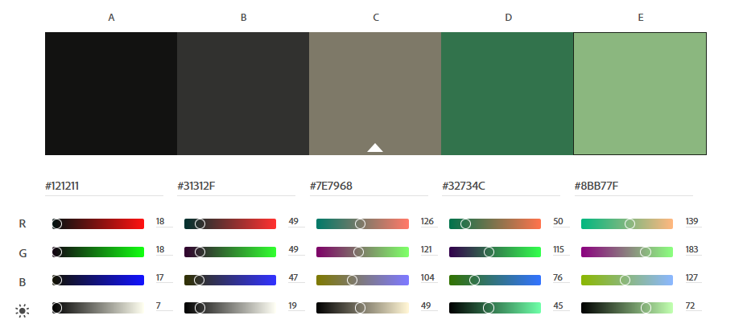

### Fonts
Poppins font was chosen for the entire website. It is one of the Geometric sans serif typefaces, that is very popular for building websites. Each letterform is nearly monolinear, with optical corrections.

### Structure
The page is structured in a well recognizable, user friendly and easy to learn way. Upon arriving to the website the user sees a familiar type of navigation bar with the studio's logo on the left side and the navigation links to the right. 
The website consists of four separate pages: 
- A homepage with with social media accounts of design studio and button to make request;
- An about page with the About Us and Our Team sections;
- An gallery with photo of projects, showcasing what you can expect from this design studio and the level of professionalism;
- A contact page with a contact form.

### Screenshots of pages

Home

About

Projects

Contact

## Technologies Used

### Languages
- HTML
- CSS
### Frameworks & Tools
- GitHub
- Gitpod
- Paint.NET
- Balsamiq
- Google Fonts
- Font Awsome
- Pinterest.COM
- Mcolor.space

## Features
The page consists of four pages

### Logo and Navigation Bar
- Featured on all four pages;
- The navbar is responsive, fixed and contains blur effect and includes links to the Homepage, About page, Gallery and Contact us page. It allows users to easily navigate the page;
- The link for the page the user wants to go is highlighted in animated green as a logo.

### Header with button-link
- Header looks like main page, that featured on tree pages with changed heading. 
- Animated green button-link sends the user to the contact page, which allows the owner to always be reminded users of the connection with the company, and the user gives the opportunity to immediately contact.

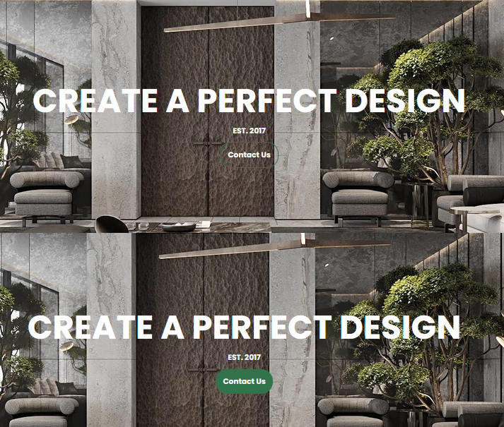

### Footer
- Featured on all four pages
- Consists of two seperate sections: social links and copyright information

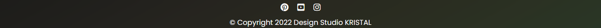

### About Us
- Gives a description of the main principles and ideas of the design studio

### Our team members
- Gives information about team and shows their photo

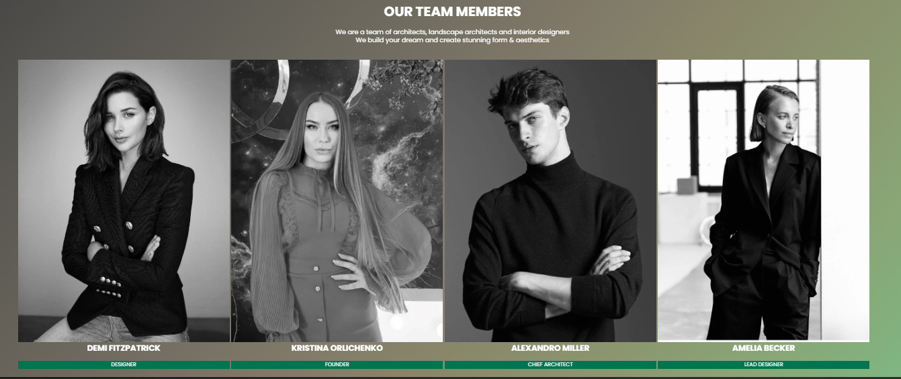

### Projects
- Images of the projects of design studio arranged in a grid

### Contact Form
- A way for user to contact with design studio or live message for the team

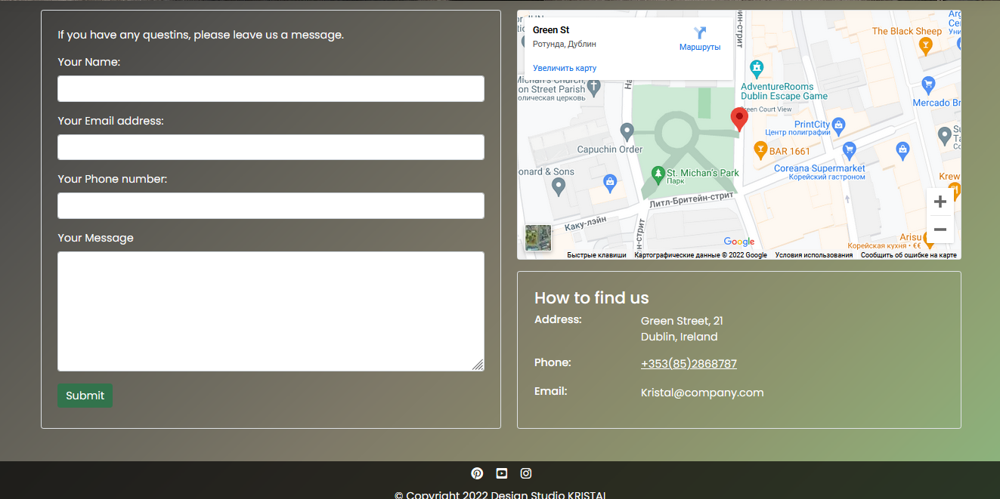

## Validation

### HTML Validation
The W3C Markup Validation Service was used to validate the HTML of the website.  
All pages pass with no errors no warnings to show.

Home

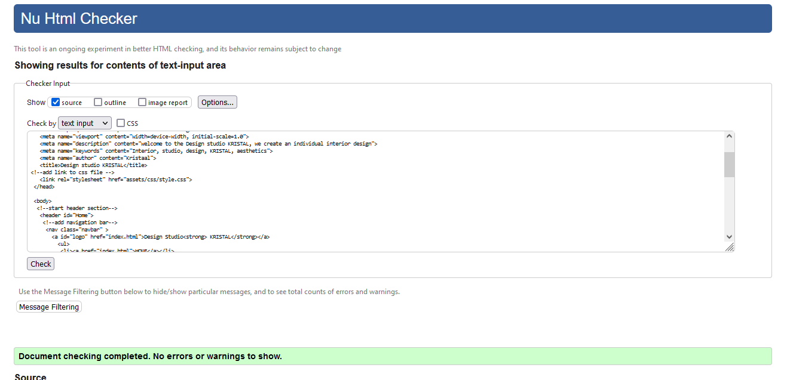

About

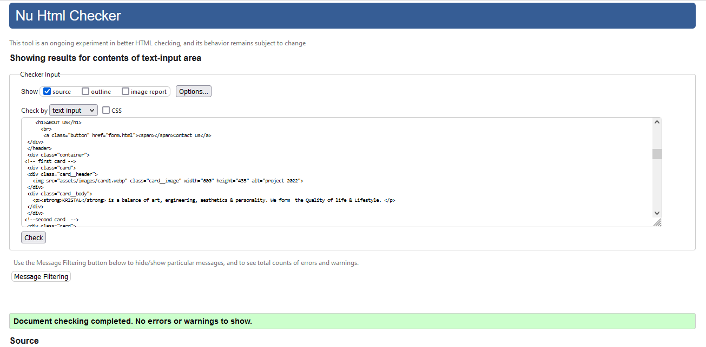

Projects

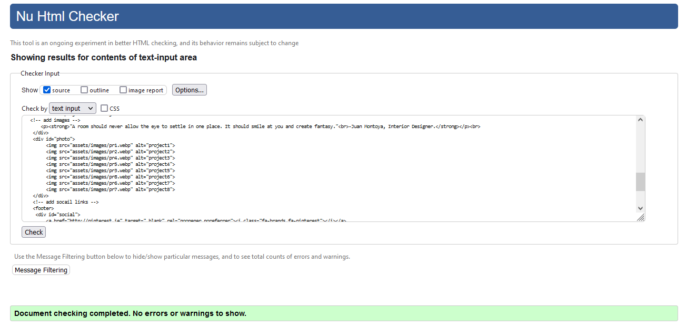

Contact

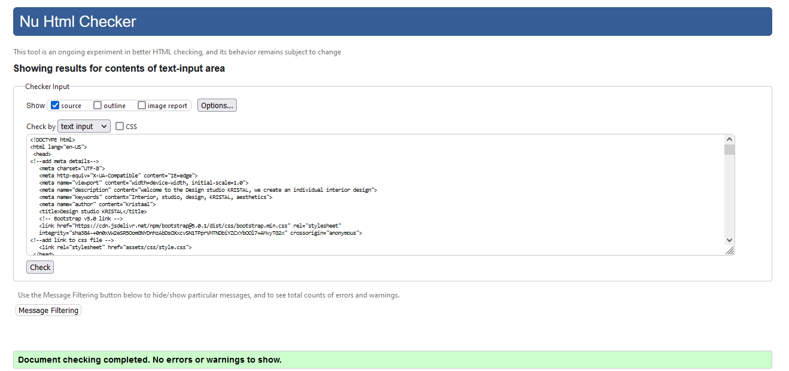

### CSS Validation
The W3C Jigsaw CSS Validation Service was used to validate the CSS of the website.
My own custom CSS passes with no errors to show.

style.css

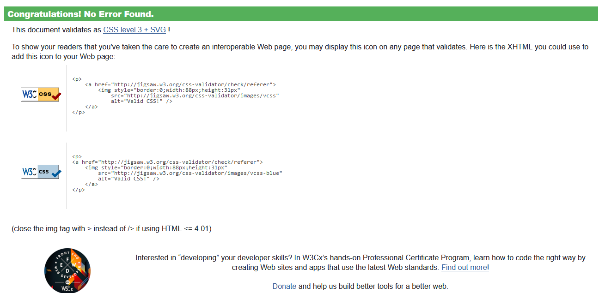

### Accessibility
The WAVE WebAIM web accessibility evaluation tool was used to ensure the website met high accessibility standards. All pages pass with 0 errors.

Home

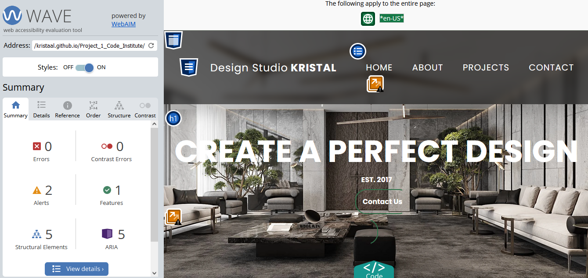

About

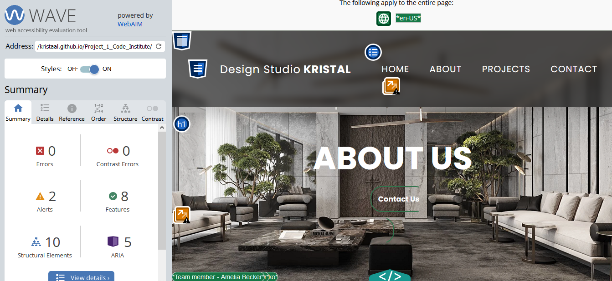

Projects

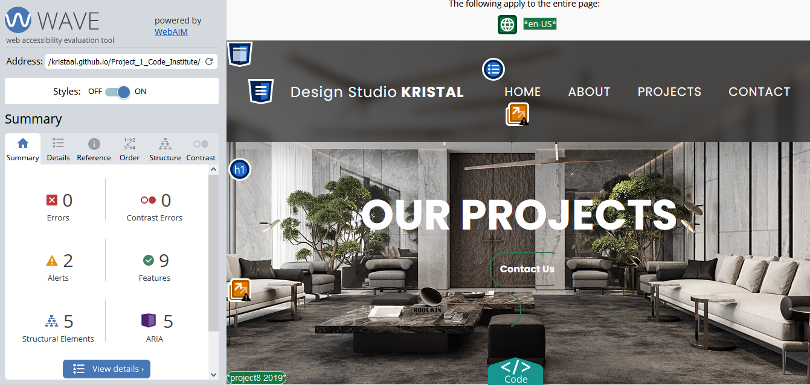

Contact

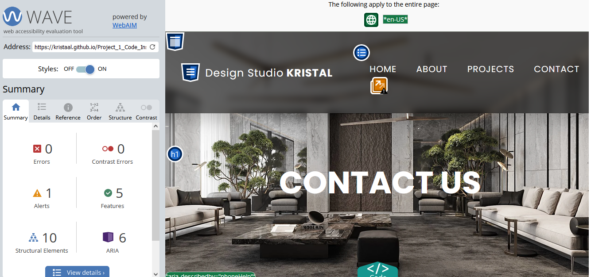

### Performance 
Google Lighthouse in Google Chrome Developer Tools was used to test the performance of the website. 

Home

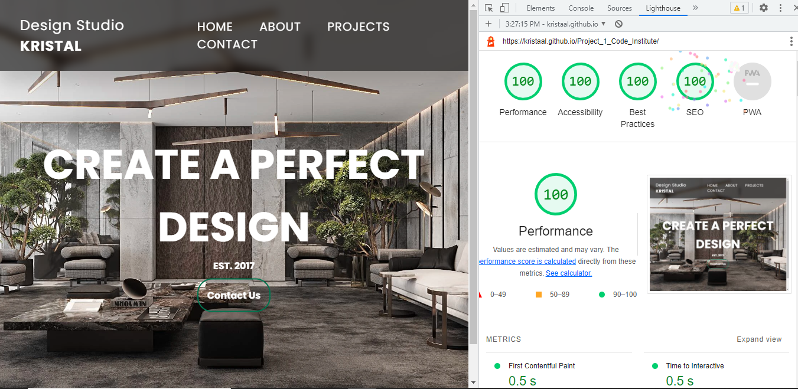

About

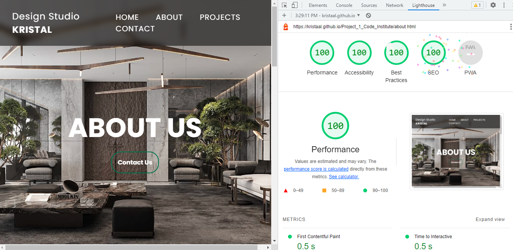

Projects

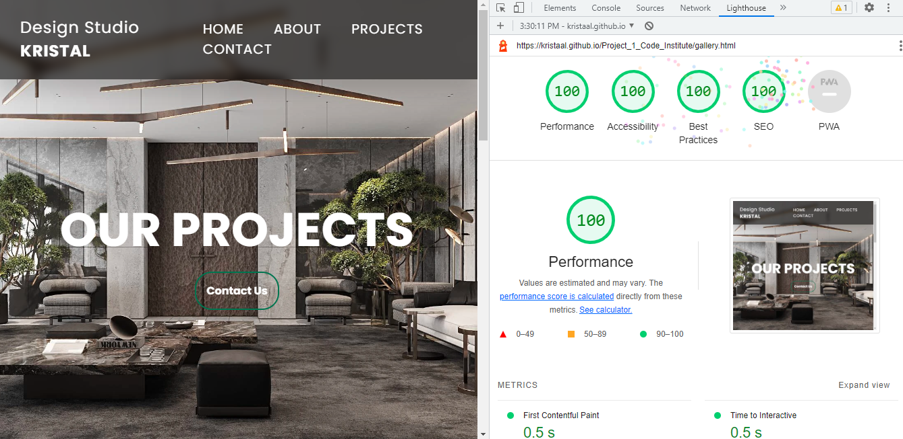

Contact

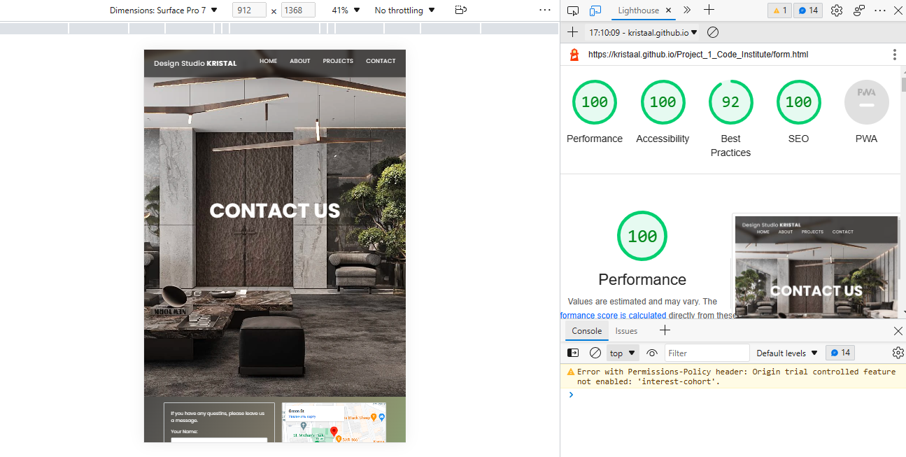

### Performing tests on various devices 
The website was tested on the following devices:
- Iphone 14 
- Iphone 13pro
- Samsung Glaxy Tab A (2016)
- Lenovo ThinkPad 

In addition, the website was tested using Google Chrome Developer Tools Device Toggeling option for all available device options.

### Browser compatability
The website was tested on the following browsers:
- Google Chrome
- Mozilla Firefox
- Microsoft Egde

### Testing user stories

1. As a first time user, I want to know more about the design studio and the main ideas of the design studio

| **Feature** | **Action** | **Expected Result** | **Actual Result** |
|-------------|------------|---------------------|-------------------|
|About Us | Navigate to the About page and locate the About Us section | Find description and main ideas of the design studio | Works as expected |
|About Us| Navigate to the About page and scroll down | Find information about team-members and their photo| Works as expected

Screenshots

 

2. As a first time user, I want to  get a feel of what to expect from this design studio and the level of their professionalism

| **Feature** | **Action** | **Expected Result** | **Actual Result** |
|-------------|------------|---------------------|-------------------|
| Projects | Navigate to the Projects page | Find gallery with design studio`s projects, what shows the level of professionalism | Works as expected |

Screenshots

 

3. As a first time user, I want to know where the design studio located

| **Feature** | **Action** | **Expected Result** | **Actual Result** |
|-------------|------------|---------------------|-------------------|
| Map | Navigate to the Contact Us page, locate the Google Map | Locating a map showing the location of the design studio | Works as expected |
|Info Box | On Contact page | Find the address of the design studio | Works as expected |

Screenshots

 

4. As a returning user, I want to see who creates project for me

| **Feature** | **Action** | **Expected Result** | **Actual Result** |
|-------------|------------|---------------------|-------------------|
|About Us| Navigate to the About page and scroll down | Find information about team-members and their photo| Works as expected

Screenshots

 

5. As a returnign user, I want to find the design studio on social media

| **Feature** | **Action** | **Expected Result** | **Actual Result** |
|-------------|------------|---------------------|-------------------|
| Footer - social media section | On all page scroll to the bottom | Click on social media links | Works as expected | 

Screenshots

 

6. As a returning user, I want to find a phone number to call

| **Feature** | **Action** | **Expected Result** | **Actual Result** |
|-------------|------------|---------------------|-------------------|
| Info Box | Navigate to Contact Us page and locate the How to find us section | See phone number | Works as expected |

Screenshots

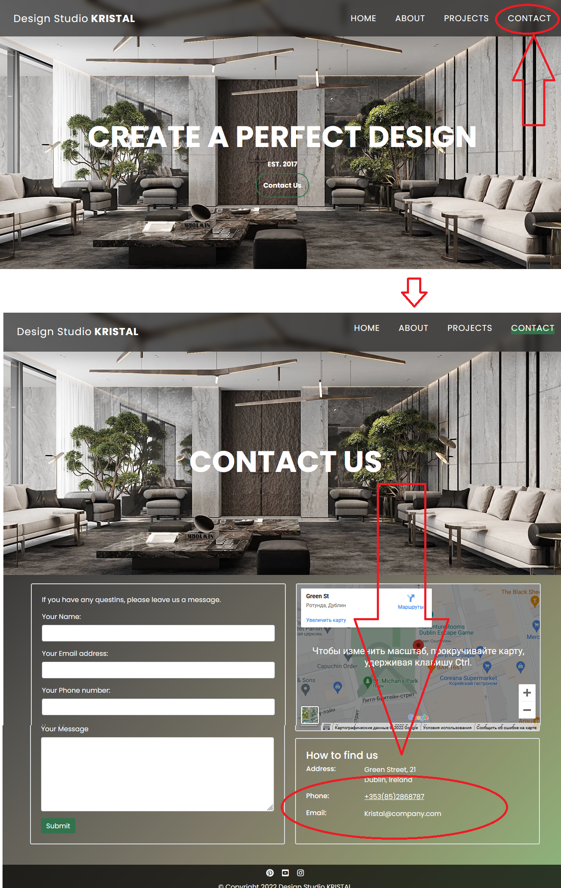

 

7. As a returning user, I want to leave some message to the team-members

| **Feature** | **Action** | **Expected Result** | **Actual Result** |
|-------------|------------|---------------------|-------------------|
| Contact Form | Navigate to the Contact Us Page and locate the contact form, fill out and submit contact form | Data submited via contact form | Works as expectd |

Screenshots

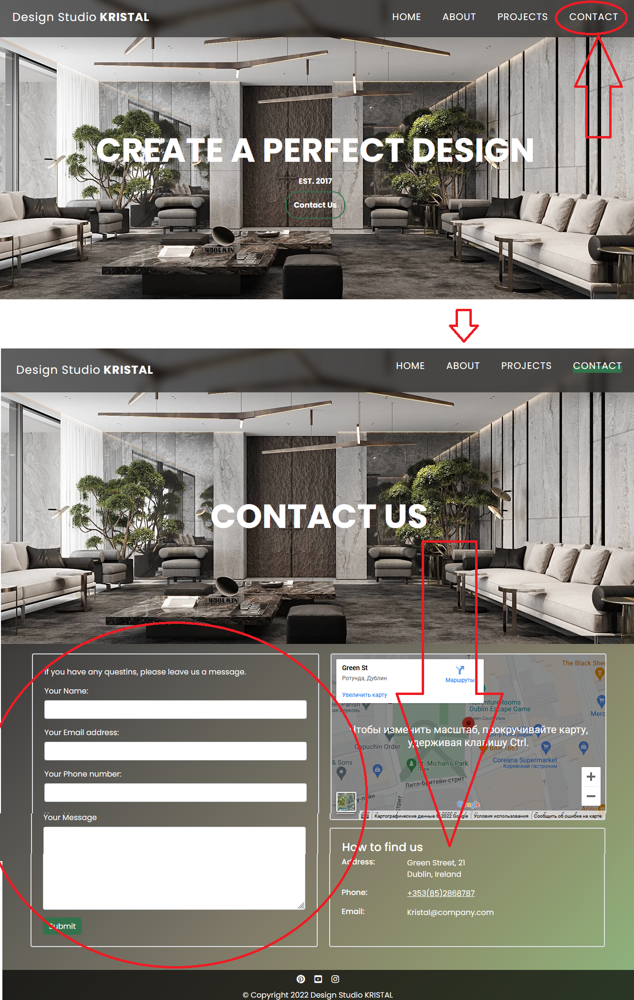

 

9. As the site owner, I want, that users to get to know the design studio and I want to point out the uniqueness and main ideas of the studio;

| **Feature** | **Action** | **Expected Result** | **Actual Result** |
|-------------|------------|---------------------|-------------------|
| About Us | Navigate to About page and locate About Us section | See relevant information about the design studio | Works as expected |

Screenshots

 

10. As the site owner, I want, that the users to be able to contact us

| **Feature** | **Action** | **Expected Result** | **Actual Result** |
|-------------|------------|---------------------|-------------------|
| Contact Form | Navigate to the Contact Us Page and locate the contact form, fill out and submit contact form | Data submited via contact form | Works as expectd |
| Info Box | Navigate to Contact Us page and locate the How to find us section | Find the phone number | Works as expected |
| Footer - contact information section | On any page scroll down to the footer | Find design studio`s acconts on social media | Works as expected |

Screenshots

 
11. As the site owner, I want to show our projects and level of our professionalism.

| **Feature** | **Action** | **Expected Result** | **Actual Result** |
|-------------|------------|---------------------|-------------------|
| Projects | Navigate to the Projects page | Find gallery with design studio`s projects, what shows the level of professionalism | Works as expected |

Screenshots

 

## Bugs

| **Bug** | **Fix** |
| ----------- | ----------- |
| The user can submit a contact form input without a number | Add required attribute to phone input field |
| Div with team containers divides into tree rows on xs screen size | Add a media query |
Images don`t have alternative text|Add alt for all img
|Images That Lack Quality |Only use high-quality images that are relevant to the content on the page|
Website isn’t mobile-friendly| Use a responsive website design and add media requires

## Deployment
The website was deployed using GitHub Pages by following these steps:
1. In the GitHub repository navigate to the Settings tab
2. On the left hand menu select Pages
3. For the source select Branch: main
4. After the webpage refreshes automaticaly you will se a ribbon on the top saying:
 Your site is live at https://kristaal.github.io/Project_1_Code_Institute/

You can for fork the repository by following these steps:
1. Go to the GitHub repository
2. Click on Fork button in upper right hand corner

You can clone the repository by following these steps:
1. Go to the GitHub repository 
2. Locate the Code button above the list of files and click it 
3. Select if you prefere to clone using HTTPS, SSH, or Github CLI and click the copy button to copy the URL to your clipboard
4. Open Git Bash
5. Change the current working directory to the one where you want the cloned directory
6. Type git clone and paste the URL from the clipboard ($ git clone https://github.com/YOUR-USERNAME/YOUR-REPOSITORY)
7. Press Enter to create your local clone.

## Acknowledgements
I would like to take the opportunity to thank:
- My mentor Spencer Barriball for his help, advice and support.
- To the lovely people on the Code Institute Slack for providing peer code reviews.
- To my colleagues with whom I study who helped solve problems together
